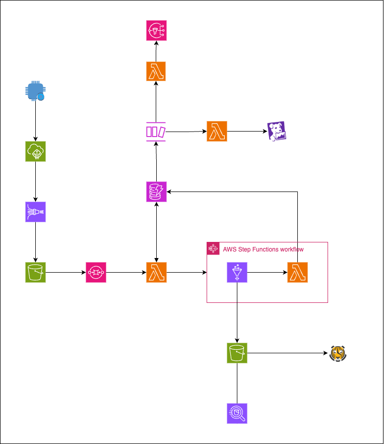
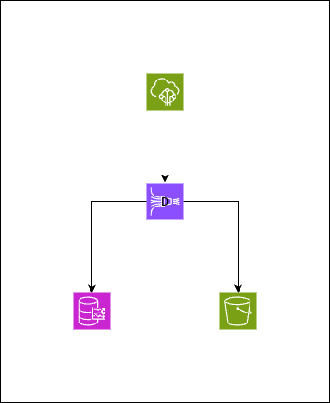

# Test Technique - 

#### Partie 1 :Cloud et Infra

## 1. Objectif

Proposer une solution simple pour stocker et exploiter des données de type timeseries.

## 2. Contraintes

La solution doit être la plus simple possible, loosely coupled et fault tolerant.

## 3. Architecture

L'architecture proposée est à 90 % déployée avec des services AWS, à l'exception de Datadog pour le monitoring et de Timescale pour le stockage de données de type timeseries.  

## 4. Description du workflow

### 1ère partie : Capteur → IoT Core → Kinesis Data Firehose → S3

La première partie consiste en l'ingestion des données brutes à partir des capteurs :  
Les capteurs envoient les données toutes les minutes. On définit des IoT Rules pour sélectionner les données qui nous intéressent, puis on les envoie vers Kinesis Firehose, qui envoie à son tour les données vers S3.  
Kinesis Firehose joue le rôle de buffer (selon des critères de taille ou de temps) et permet d’éviter d’avoir **un fichier/capteur/minute**.

---

### 2ème partie : S3 → SQS → Lambda → DynamoDB

Le dépôt d’un fichier sur S3 génère un event, qui est envoyé à SQS. Ensuite, une Lambda consomme le message et écrit les métadonnées concernant le fichier à ingérer :  
- nom du fichier  
- date de création  
- statut (initialement *To Process*)  
- capteur, etc.  

Chaque fois qu'un fichier arrive, une nouvelle entrée DynamoDB est créée.  
Lorsqu’un certain seuil (à définir) est atteint (par exemple 5 fichiers en attente), la Lambda déclenche une Step Function qui lance le workflow d’ingestion :  

- Un Glue Job en spark agrège les données des différents capteurs et des différents intervalles horaires dans un seul fichier **Parquet compressé**, stocké ensuite dans un bucket S3 dédié.  
- La Step Function se termine avec une Lambda qui met à jour le statut des métadonnées dans DynamoDB à *DONE* et ajoute la date de fin.  
- En cas d’échec du job Glue, la Lambda met à jour le statut en *FAILED*.  

---

### 3ème partie : Monitoring 1 (DynamoDB → DynamoDB Stream → Lambda → Datadog)

DynamoDB Stream détecte tout changement dans la table DynamoDB.  
La Lambda filtre les événements, en particulier le changement de statut de *To Process* → *Done*. Cela signifie que le workflow est terminé pour le fichier concerné.  

Des métriques sont alors calculées à partir des données DynamoDB et envoyées à Datadog.  
Ce monitoring permet de voir, par exemple, **quelles données de quels capteurs et pour quelles périodes** ont été ingérées, et éventuellement de détecter des données manquantes.

---

### 4ème partie : Monitoring 2 (DynamoDB → DynamoDB Stream → Lambda → SNS)

DynamoDB Stream détecte tout changement dans la table DynamoDB.  
La Lambda filtre cette fois sur les event avec un changement de status *To Process* → *Failed*

---

### 4ème partie : S3 → Timescale

Une fois les données au format **Parquet compressé** stockées dans S3, on utilise une feature récente de Timescale (via TigerData) : *LiveSync for S3*.  
Cette fonctionnalité permet de synchroniser automatiquement les données S3 avec la base de données TimescaleDB.

---

### 5ème partie : S3 → Athena

Cette partie offre une solution intuitive pour effectuer des requêtes ad hoc sur les données.

---

## 5. Fault Tolerance

1. **SQS avec DLQ** :  
   SQS permet d'éviter la perte de messages en cas d'échec de traitement des Lambdas.  
   Les messages non traités sont automatiquement redirigés vers une Dead Letter Queue.

2. **DynamoDB (système de statuts)** :  
   Les statuts (*To Process → Processing → Done → Failed*) permettent de suivre l’avancement des workflows et d’identifier les échecs facilement et donc de relancer les workflow.

3. **Multi-AZ** :  
   Tous les services AWS utilisés (S3, SQS, Lambda, DynamoDB) sont naturellement distribués sur plusieurs zones de disponibilité.

## 6. Alterntive : Timestream :

Une autre alternative à TimescaleDB est l’utilisation d’AWS Timestream. L’avantage de cette solution est qu’elle reste 100 % native AWS, et que Kinesis Firehose peut y écrire directement (voir figure ci-dessus). En revanche, on perd la possibilité de réaliser l’enrichissement, la validation et l’agrégation des données avant leur stockage, ce qui est essentiel pour des données IoT souvent bruitées. De plus, Timestream est ([150x plus cher et moins performant](https://www.tigerdata.com/blog/timescaledb-vs-amazon-timestream-6000x-higher-inserts-175x-faster-queries-220x-cheaper#about-timescaledb-and-amazon-timestream)) par rapport à Timescale.

## 6. Temps de traitement et performances :
Cette architecture offre un traitement en micro-batch avec une latence totale estimée entre 15 minutes et 1 heure selon la configuration :
Latence détaillée :

Firehose buffer : 1-15 minutes (configurable selon taille/temps)
Accumulation jusqu'au seuil : Variable (selon le nombre de fichiers à traiter)
Job Spark d'agrégation : 5-15 minutes
Synchronisation TimescaleDB : 1-5 minutes

##  7. Conclusion :
Cette architecture répond aux exigences du test technique en proposant une solution simple, découplée et fault tolerant pour l'ingestion de données timeseries.

#### Partie 2 :

# Description du script

Ce script **charge des données de passagers par capteur depuis un fichier CSV**, calcule des statistiques de base et les sauvegarde dans des fichiers CSV.

## Fonctionnalités principales

1. **Lecture des données**  
   - Charge le fichier CSV dans un **DataFrame Polars**.  
   - Colonnes attendues : `timestamp`, `sensor_id`, `passengers`.

2. **Calcul des métriques**  
   - **Total des passagers par capteur** : somme des passagers enregistrés pour chaque capteur.  
   - **Moyenne des passagers par capteur** : moyenne des passagers observés pour chaque capteur.

3. **Sauvegarde des résultats**  
   - Écrit le total et la moyenne dans deux fichiers CSV séparés (`total_passagers.csv` et `moyenne_passagers.csv`).

4. **Affichage**  
   - Affiche le total et la moyenne par capteur pour vérification rapide.

On pourra facilement ajouter des calculs de statistiques en rajoutant des fonctions et les inclure dans la fonction main.
Le chemin du fichier CSV à traiter doit être indiqué dans le bloc `if __name__ == "__main__":` avant d'appeler la fonction `main()`.  
